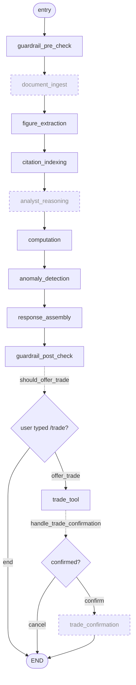

# biaa-fri — Financial-Report Insight Agent

An agent that reads financial reports (10-K/10-Q PDFs, HTML filings, XBRL) and answers
questions about them **without inventing a number and without giving advice**.

## The problem

Ask a general-purpose LLM "what's this company's current ratio?" over a 200-page annual report
and you hit three failure modes that matter more in finance than almost anywhere else:

1. **Ungrounded figures.** The model emits a number with no way to trace where it came from.
2. **Arithmetic by autocomplete.** LLMs do arithmetic by predicting tokens, so a ratio can come
   out plausibly wrong — the worst kind of wrong in a financial context.
3. **Accidental advice.** "Revenue fell 25%, so you should sell" is regulated speech. An
   analysis tool must not cross that line, even casually.

The app is built around refusing all three:

| Capability | How it is enforced |
|---|---|
| **Source grounding** | Every figure is stored as `(value, unit, source_loc)` with doc, page and section. Figures that can't be located are marked `[UNVERIFIED]` and excluded from computation. |
| **Claim citation** | Responses carry inline anchors (`see Income Statement, p. 12`) and end with a Sources block built from a citation index. |
| **Safe computation** | Ratios are computed by a deterministic module via `RestrictedPython` — **never** by the LLM. It returns `{result, formula, inputs_with_sources}`; the LLM only formats. |
| **Anomaly flagging** | Materiality (% of revenue) and z-score outliers surface with `info`/`warning`/`critical` severity — as observations, never conclusions. |
| **No-advice guardrail** | Advisory language is intercepted on both input and output, offending sentences are rewritten to be observational, and every interception is logged. |
| **Withheld trade tool** | Off unless the user explicitly types `/trade`, and it only produces a draft the user submits themselves. It never places an order. |

Specs: [requirements](todo/001-financial-report-insight-agent-requirements.md) ·
[design](todo/002-financial-report-insight-agent-design.md).

## How LangChain and LangGraph are used

Short version: **LangGraph is not wired in yet, and LangChain is used for exactly one thing.**
The design calls for more; the code hasn't caught up. That gap is worth stating plainly rather
than describing the intended architecture as if it shipped.

### LangGraph — designed and pinned, not yet used

`langgraph` is pinned in `requirements.txt` and §3.2 of the design doc specifies a full
`StateGraph` topology. **No `.py` file constructs one.** There is no `StateGraph`, `add_node`,
or `add_conditional_edges` anywhere in `backend/`.

#### The intended workflow

This is the topology from design doc §3.2. Solid boxes are nodes that exist **and** run today;
dashed boxes exist in the design but are not part of any executed pipeline.



#### What is actually implemented

| Design node | In `agent.py` | Runs today? |
|---|---|---|
| `guardrail_pre_check` | yes | yes |
| `document_ingest` | **no node** | ingest runs in `POST /api/documents/upload`, outside any pipeline |
| `figure_extraction` | yes | yes |
| `citation_indexing` | yes | yes |
| `analyst_reasoning` | yes | **no — dead code**, never imported or called |
| `computation` | yes | yes |
| `anomaly_detection` | yes | yes |
| `response_assembly` | yes | yes |
| `guardrail_post_check` | yes | yes |
| `trade_tool` | yes | yes, but via `POST /api/trade/draft`, not a graph edge |
| `trade_confirmation` | **no node** | `POST /api/trade/confirm/{id}` returns a canned response |

Routers: `should_offer_trade` is called directly in `main.py`; `handle_trade_confirmation` is
written but never referenced.

So the pipeline that actually runs is seven of the nine nodes in the designed linear spine
(`document_ingest` and `analyst_reasoning` are the two that don't):

```
guardrail_pre_check → figure_extraction → citation_indexing → computation
  → anomaly_detection → response_assembly → guardrail_post_check
```

Note `analyst_reasoning` would be redundant even if wired: it writes `final_response`, which
`response_assembly` overwrites two steps later.

#### Why the nodes are graph-ready

Every node already honours the contract LangGraph expects — take the state, return a **partial**
dict to be merged in:

```python
def guardrail_pre_check(state: FinancialAgentState) -> dict:
    result = pre_check_guardrail(state.user_query)
    if result["detected"]:
        return {"user_query": result["augmented_query"]}
    return {}          # empty dict == no state change
```

The routers likewise return the string keys an `add_conditional_edges` mapping dispatches on
(`"offer_trade"` / `"end"`, `"confirm"` / `"end"`). The shared state is the Pydantic model
`FinancialAgentState` in `shared/schemas.py`, and each node owns distinct keys — which is exactly
why a merge-based graph fits:

| Node | Writes |
|---|---|
| `guardrail_pre_check` | `user_query` (only when advisory phrasing is detected) |
| `figure_extraction` | `extracted_figures` |
| `citation_indexing` | `citation_index` |
| `computation` | `computations` |
| `anomaly_detection` | `anomalies` |
| `response_assembly` | `final_response` |
| `guardrail_post_check` | `rewritten_response`, `guardrail_interceptions`, `final_response` |
| `trade_tool` | `trade_draft` |

What's missing is only the wiring. `main.py` currently replays the merge by hand:

```python
updates = guardrail_pre_check(state)
state_dict.update(updates)
state = FinancialAgentState(**state_dict)

updates = figure_extraction(state)
state_dict.update(updates)
state = FinancialAgentState(**state_dict)
# ...repeated for every node, in both the REST and WebSocket paths
```

That loop is a hand-rolled `StateGraph`. Replacing it means building the graph once (design doc
§3.2 has the ~30 lines) and calling `graph.invoke(state)`.

#### What the missing graph costs

- **No checkpointing / resumable threads.** `AnalysisRequest` accepts a `thread_id`, but with no
  checkpointer there is nothing to resume; each request replays from scratch.
- **No conditional routing.** The `/trade` branch is split across separate endpoints instead of
  being edges, so the confirmation step is a canned response rather than a graph node.
- **Duplicated orchestration, already drifting.** `POST /api/analysis/query` and
  `WS /ws/analysis/stream` each hand-roll the same seven nodes, but only the REST path then
  checks `should_offer_trade` and runs `trade_tool`. Typing `/trade` over the WebSocket produces
  no draft; the identical query over REST does. One graph would give both paths one definition.

### LangChain — one lazy import, for optional LLM extraction

The **only** LangChain use in the codebase is in `backend/agent.py`:

```python
from langchain_openai import ChatOpenAI
llm = ChatOpenAI(
    model=settings.llm_model,                     # default: llama-3.1-8b-instant
    api_key=settings.groq_api_key,
    base_url="https://api.groq.com/openai/v1",    # Groq's OpenAI-compatible endpoint
)
```

Worth knowing:

- It powers **figure extraction only** (`extract_figures_with_llm`), as an accuracy improvement
  over the regex extractor. Everything else — computation, anomaly detection, guardrails,
  response assembly — is deterministic Python with no LLM in the loop.
- It is **optional**. With no `LLM_API_KEY` set, the function returns `[]` immediately and the
  regex extractor in `extract_figures_from_text` does the work. The app is fully functional with
  no LLM configured at all.
- `ChatOpenAI` here talks to **Groq**, not OpenAI, via an OpenAI-compatible base URL.
- `langchain` and `langchain-core` are pinned but never imported directly; they arrive as
  transitive dependencies of `langchain-openai` and `langgraph`.

Keeping the LLM out of the arithmetic is deliberate: a model that can't do the math can't get
the math wrong (requirement C3).

## Running it

The whole app ships as one image — React UI, API, WebSocket, embedded Chroma and SQLite, one
process on one port:

```bash
docker build -t biaa-fri .
docker run -p 8000:8000 -v biaa-data:/data biaa-fri
```

Then open <http://localhost:8000>.

**Mount the volume.** Without `-v`, SQLite and the Chroma index live in the container's writable
layer and disappear on `docker rm`.

The embedding model (~80MB ONNX `all-MiniLM-L6-v2`) is baked in at build time, so the first
upload is fast and the container needs no network egress at runtime.

### Configuration

| Env var | Default | Purpose |
|---|---|---|
| `DATABASE_URL` | `sqlite:////data/app.db` | Point at `postgresql://…` to use Postgres instead. |
| `LLM_API_KEY` | *(empty)* | Enables LLM figure extraction. Unset = regex extractor only. |
| `GROQ_API_KEY` | *(empty)* | Groq credential used by `ChatOpenAI`. |
| `LLM_MODEL` | `llama-3.1-8b-instant` | Groq model id. |
| `CHROMA_EMBEDDED` | `true` | `false` targets an external Chroma at `CHROMA_HOST`/`CHROMA_PORT`. |
| `TRADE_TOOL_ENABLED` | `true` | Master switch for the withheld trade tool. |
| `MATERIALITY_THRESHOLD` | `0.10` | Flag line items above this share of revenue. |
| `Z_SCORE_THRESHOLD` | `2.0` | Outlier threshold for anomaly detection. |

### API

| Endpoint | Purpose |
|---|---|
| `POST /api/documents/upload` | Ingest a PDF/HTML/XBRL/text report. Deduplicates on content hash. |
| `GET /api/documents` | List ingested documents. |
| `POST /api/analysis/query` | Ask a question. Returns response, citations, computations, anomalies. |
| `WS /ws/analysis/stream` | Same pipeline, streamed node by node. |
| `POST /api/trade/draft` | Generate a trade draft (never executes). |
| `GET /api/audit/guardrail-logs` | Guardrail interception log. |
| `GET /health`, `GET /ready` | Health probes. |

## Development

```bash
pip install -r requirements.txt -r requirements-dev.txt
pytest tests/
uvicorn backend.main:app --reload        # API on :8000
```

`backend/main.py` mounts the built React bundle from `STATIC_DIR` (default `frontend/build`). If
it isn't there, it logs a warning and serves the API only — so `uvicorn` alone is fine for
backend work.

For the frontend:

```bash
cd frontend && npm install && npm run build   # then uvicorn serves it at :8000
```

`npm start` (CRA dev server on :3000) will serve the UI but **its API calls will 404** — the
client calls relative `/api` paths and `frontend/package.json` has no `proxy` field. Either add
`"proxy": "http://localhost:8000"` to it, or use `npm run build` + uvicorn as above.

## Status

Working: document ingest (PDF/HTML/XBRL/text), regex + optional LLM figure extraction, citation
indexing, deterministic computation, anomaly detection, both guardrails, the trade-draft tool,
and document persistence on SQLite or Postgres.

Known gaps:

- **The LangGraph topology isn't wired** — see above. The pipeline is hand-rolled in `main.py`,
  `analyst_reasoning` and `handle_trade_confirmation` are dead code, and `document_ingest` and
  `trade_confirmation` never became nodes at all.
- **`/trade` works over REST but not WebSocket** — a direct consequence of the orchestration
  being duplicated by hand rather than defined once as a graph.
- **Part of the persistence layer is unused.** `backend/database.py` defines repository functions
  for figures, guardrail events and trade drafts that nothing calls yet. Only documents and
  chunks are actually persisted; guardrail logs (`main._audit_log`) and trade drafts still live
  in process memory and are lost on restart.
- **Single worker only.** Because that audit log is per-process, `--workers > 1` would serve
  requests from unshared state. The image pins `--workers 1`.
- **Parts of the test suite fail.** `pytest tests/` currently shows pre-existing failures in the
  API-endpoint and WebSocket suites.
